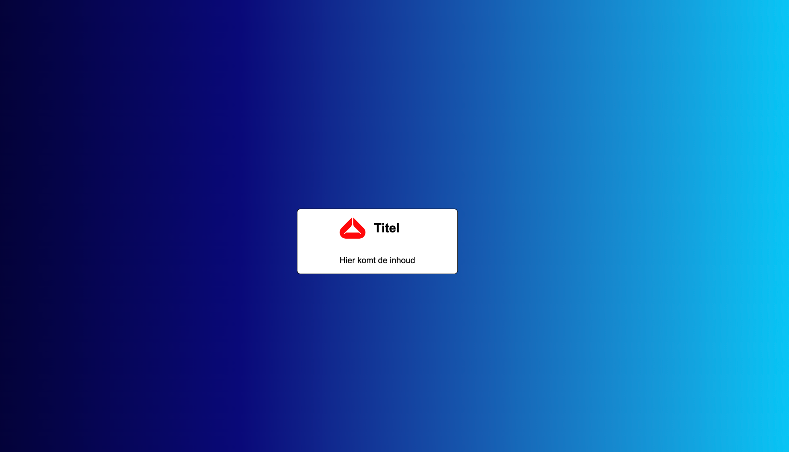

# Oefeningen labo 9

Zorg dat je de volgende folder structuur volgt:

```
webtechnologie/
├─ labo-01/
│  ├─ oefening-01/
│  │  ├─ index.html
│  │  ├─ images/
│  │  │  ├─ image-1.jpg
│  │  │  └─ image-n.jpg
│  │  ├─ css/
│  │  │   ├─ reset.css
│  │  │   └─ style.css
│  │  └─ js/
│  │     └─ script.js
│  ├─ oefening-02/
│  └─ oefening-n/
├─ labo-02/
└─ labo-n/
```

## Algemene opzet

- Gebruik opnieuw overal reset.css.
- Oefeningen 1 tot en met 5 zijn allemaal gebaseerd op hetzelfde 
- Voorzie de achtergrond van de body van een leuke gradient. Gebruik hiervoor een CSS gradient generator tool zoals [cssgradient.io](https://cssgradient.io/).
- Zorg ervoor dat de body children zowel verticaal als horizontaal in het midden van de webpagina gecentreerd staan. Gebruik hiervoor CSS Grid.
